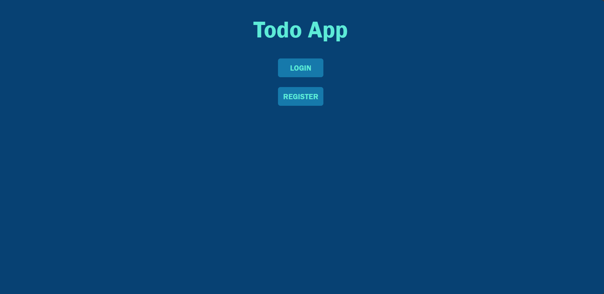
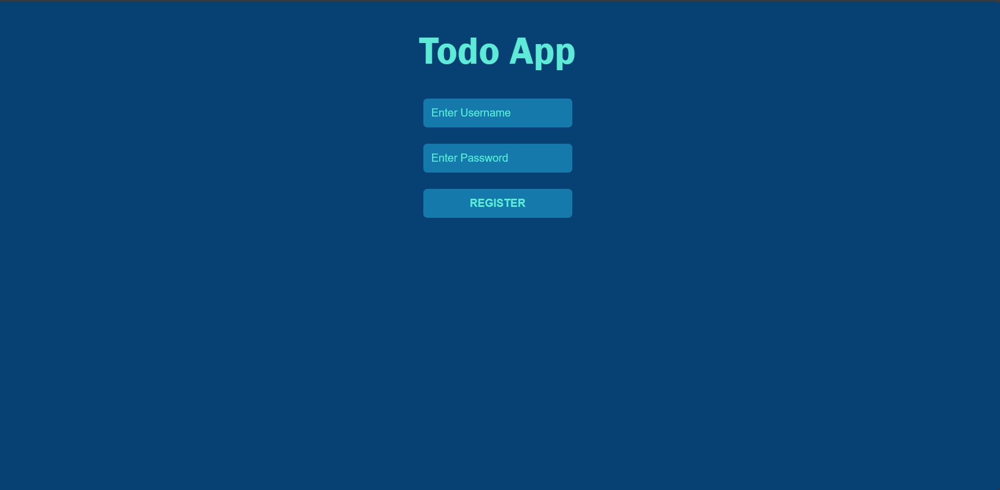
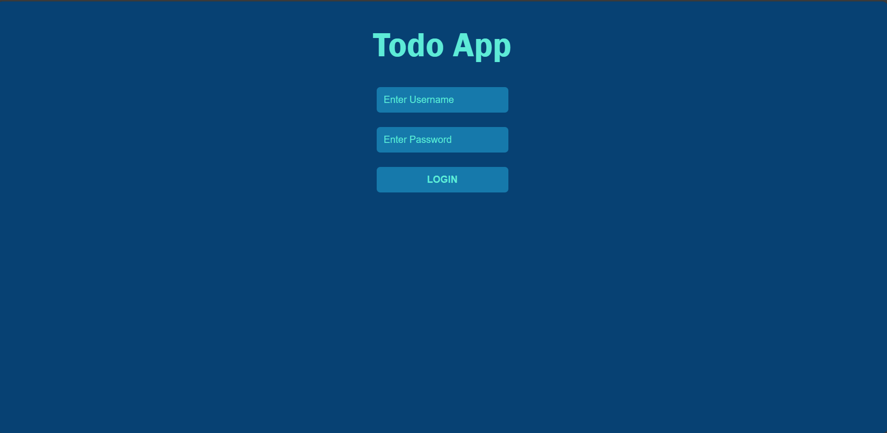
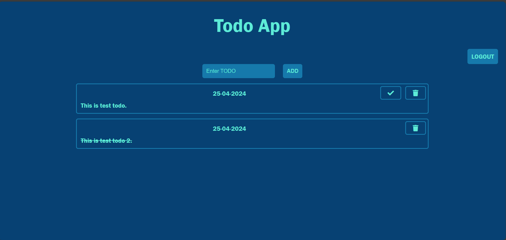

# Todo App

Todo App is a web application which allows its users to manage their tasks. It supports authentication to handle multiple users. It is developed using Python Flask. It uses Mongodb for managing users' data.

## Features

* Create a new Todo
* Read all Todos
* Update status of a Todo
* Delete a Todo

## Todo App UI

**HOME PAGE**

**REGISTER PAGE**

**LOGIN PAGE**

**TODO PAGE**

